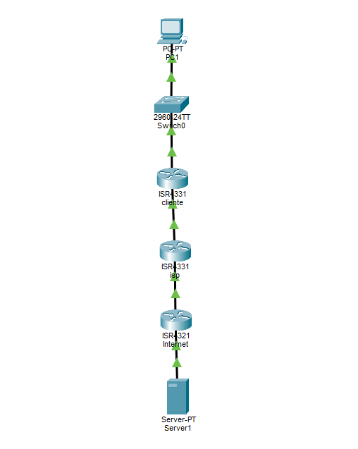

# Lab 02 — Gateway Incorreto

## Cenário

Uma empresa cliente de um provedor de Internet entrou em contato com o suporte técnico informando que estava sem acesso à Internet.

## Objetivo

Identificar uma falha relacionada à configuração do gateway padrão do cliente, realizar o diagnóstico utilizando testes de conectividade e aplicar a correção necessária.

## Topologia

## Endereçamento IP

| Equipamento | Interface | Endereço IP | Máscara | Gateway |
|---|---|---|---|---|
| PC1 | NIC | 192.168.20.10 | 255.255.255.0 | 192.168.20.2 |
| Router Cliente | G0/0/0 | 192.168.20.1 | 255.255.255.0 | — |
| Router Cliente | G0/0/1 | 203.0.114.2 | 255.255.255.252 | — |
| Router ISP | G0/0/0 | 203.0.114.1 | 255.255.255.252 | — |
| Router ISP | G0/0/1 | 198.51.101.1 | 255.255.255.252 | — |
| Router Internet | G0/0/0 | 198.51.101.2 | 255.255.255.252 | — |
| Router Internet | G0/0/1 | 8.8.8.1 | 255.255.255.0 | — |
| Server | NIC | 8.8.8.8 | 255.255.255.0 | 8.8.8.1 |

## Investigação

### Teste 1 — PC1 → Gateway

Comando:

`ping 192.168.20.1`

Resultado:

100% de sucesso.

O PC1 conseguia alcançar o endereço da interface LAN do Router Cliente.

### Teste 2 — PC1 → Internet

Comando:

`ping 8.8.8.8`

Resultado inicial:

Falha / timeout.

A comunicação com o gateway local funcionava, mas o acesso ao destino externo falhava.

## Diagnóstico

Foi analisada a configuração de rede do PC1.

Configuração encontrada:

`IP: 192.168.20.10`

`Máscara: 255.255.255.0`

`Gateway: 192.168.20.2`

O gateway estava incorreto.

A interface LAN do Router Cliente estava configurada como:

`192.168.20.1`

Portanto, o gateway correto para o PC1 era:

`192.168.20.1`

## Correção

O gateway do PC1 foi alterado de:

`192.168.20.2`

para:

`192.168.20.1`

## Validação

Após a correção, foi executado:

`ping 8.8.8.8`

Resultado:

Reply recebido com sucesso.

A conectividade com o destino externo foi restabelecida.

## Evidências

### Falha

### Validação final

## Diagnóstico final

A indisponibilidade de acesso à Internet foi causada por um gateway padrão incorreto configurado no PC1.

O endereço configurado não correspondia à interface LAN do roteador responsável pelo encaminhamento do tráfego.

Após a correção do gateway para `192.168.20.1`, a conectividade com `8.8.8.8` foi restabelecida.

## Competências praticadas

- IPv4
- Gateway
- Endereçamento IP
- ICMP
- Ping
- Troubleshooting
- Diagnóstico de conectividade
- Análise de configuração de host
- Validação pós-correção