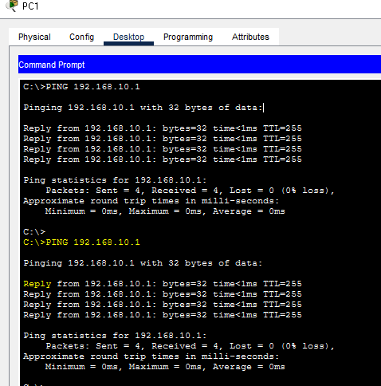
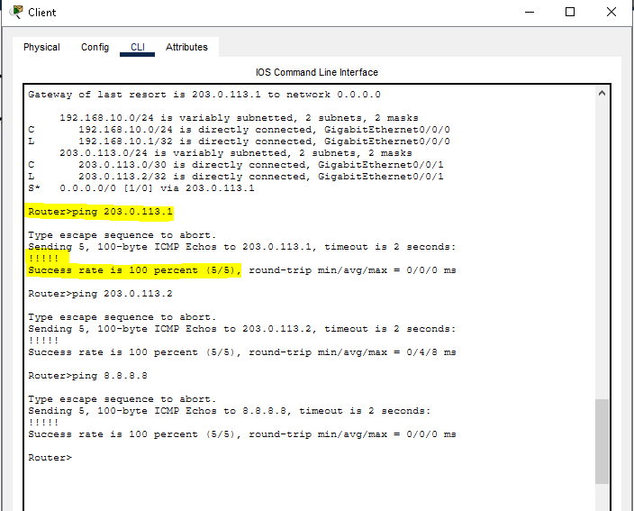
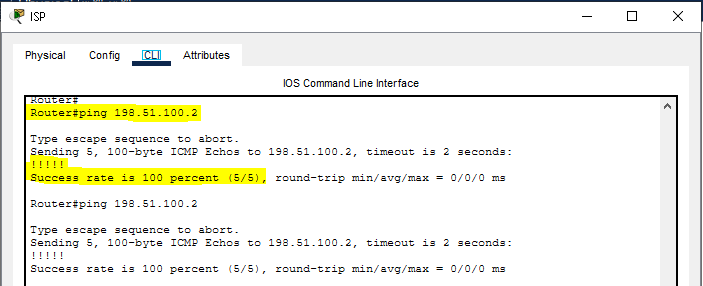
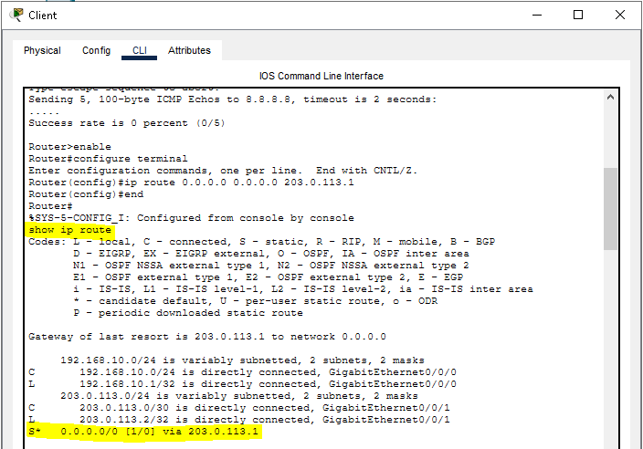
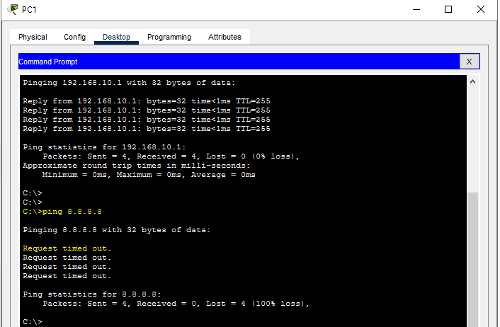
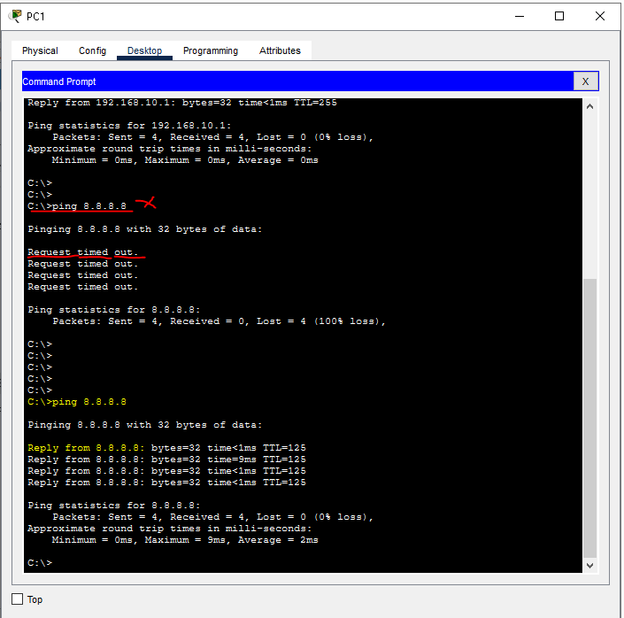

# Lab 01 — Cliente sem Internet

## Cenário

Uma empresa cliente de um provedor de Internet entrou em contato informando que estava sem acesso à Internet.

### Cliente

- Empresa: Empresa Alfa
- Serviço: Internet
- Velocidade contratada: 500 Mbps
- Prioridade: Alta
- Status inicial: Em aberto

## Objetivo

Investigar a indisponibilidade de Internet utilizando uma abordagem de troubleshooting por etapas, identificar os pontos de falha, realizar as correções necessárias e validar a conectividade ponta a ponta.

## Topologia

## Equipamentos

- 1 PC
- 1 Switch Cisco 2960
- 3 Routers Cisco ISR 4331
- 1 Server

## Endereçamento IP

| Equipamento | Interface | Endereço IP | Máscara | Função |
|---|---|---|---|---|
| PC1 | NIC | 192.168.10.10 | 255.255.255.0 | Cliente |
| Router Cliente | G0/0/0 | 192.168.10.1 | 255.255.255.0 | Gateway LAN |
| Router Cliente | G0/0/1 | 203.0.113.2 | 255.255.255.252 | WAN |
| Router ISP | G0/0/0 | 203.0.113.1 | 255.255.255.252 | WAN |
| Router ISP | G0/0/1 | 198.51.100.1 | 255.255.255.252 | Upstream |
| Router Internet | G0/0/0 | 198.51.100.2 | 255.255.255.252 | Upstream |
| Router Internet | G0/0/1 | 8.8.8.1 | 255.255.255.0 | Rede externa |
| Server | NIC | 8.8.8.8 | 255.255.255.0 | Destino |

## Investigação

### Teste 1 — PC1 → Gateway

Comando:

`ping 192.168.10.1`

Resultado: 100% de sucesso.

Conclusão: a comunicação entre o PC1 e o gateway local estava funcionando.

### Teste 2 — Router Cliente → Router ISP

Comando:

`ping 203.0.113.1`

Resultado: 100% de sucesso.

Conclusão: o enlace WAN entre o Router Cliente e o Router ISP estava funcionando.

### Teste 3 — Router ISP → Router Internet

Comando:

`ping 198.51.100.2`

Resultado: 100% de sucesso.

Conclusão: o enlace entre o Router ISP e o Router Internet estava funcionando.

### Teste 4 — Router Cliente → Internet

Comando:

`ping 8.8.8.8`

Resultado inicial: 0% de sucesso.

Foi iniciada a investigação de roteamento.

## Falhas identificadas

### 1. Ausência de rota padrão no Router Cliente

Foi identificado:

`Gateway of last resort is not set`

Correção:

`ip route 0.0.0.0 0.0.0.0 203.0.113.1`

### 2. Ausência de rota padrão no Router ISP

O Router ISP não possuía uma rota para destinos externos.

Correção:

`ip route 0.0.0.0 0.0.0.0 198.51.100.2`

### 3. Gateway incorreto no Server

O gateway configurado no Server estava incorreto.

Correção:

`8.8.8.1`

### 4. Ausência de rota para a LAN do cliente no Router ISP

O Router ISP não conhecia a rede `192.168.10.0/24`.

Correção:

`ip route 192.168.10.0 255.255.255.0 203.0.113.2`

### 5. Ausência de rota de retorno no Router Internet

O Router Internet não conhecia a rede `192.168.10.0/24`.

Correção:

`ip route 192.168.10.0 255.255.255.0 198.51.100.1`

## Evidências

As capturas utilizadas durante a investigação estão armazenadas na pasta `evidencias`.

### 01 — PC1 → Gateway

### 02 — Router Cliente → Router ISP

### 03 — Router ISP → Router Internet

### 04 — Tabela de roteamento

### 05 — Falha de conectividade

### 06 — Validação final

## Validação final

Após as correções, foi realizado o teste de conectividade a partir do PC1:

`ping 8.8.8.8`

Resultado: Reply.

A conectividade ponta a ponta foi restabelecida.

## Diagnóstico final

O incidente envolvia múltiplas falhas de configuração de rede.

Foram identificados:

- ausência de rota padrão no Router Cliente;
- ausência de rota padrão no Router ISP;
- gateway incorreto no Server;
- ausência de rota para a LAN do cliente no Router ISP;
- ausência de rota de retorno no Router Internet.

## Competências praticadas

- IPv4
- Endereçamento IP
- Máscara de rede
- Gateway
- ICMP
- Ping
- Cisco IOS
- Tabela de roteamento
- Rota estática
- Rota padrão
- Rota de retorno
- Troubleshooting
- Diagnóstico por evidências
- Validação ponta a ponta

## Arquivo do laboratório

[Laboratório Cisco Packet Tracer](laboratorio.pkt)
